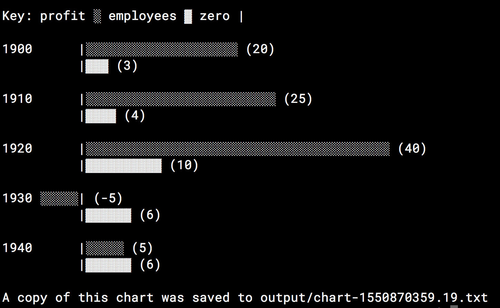
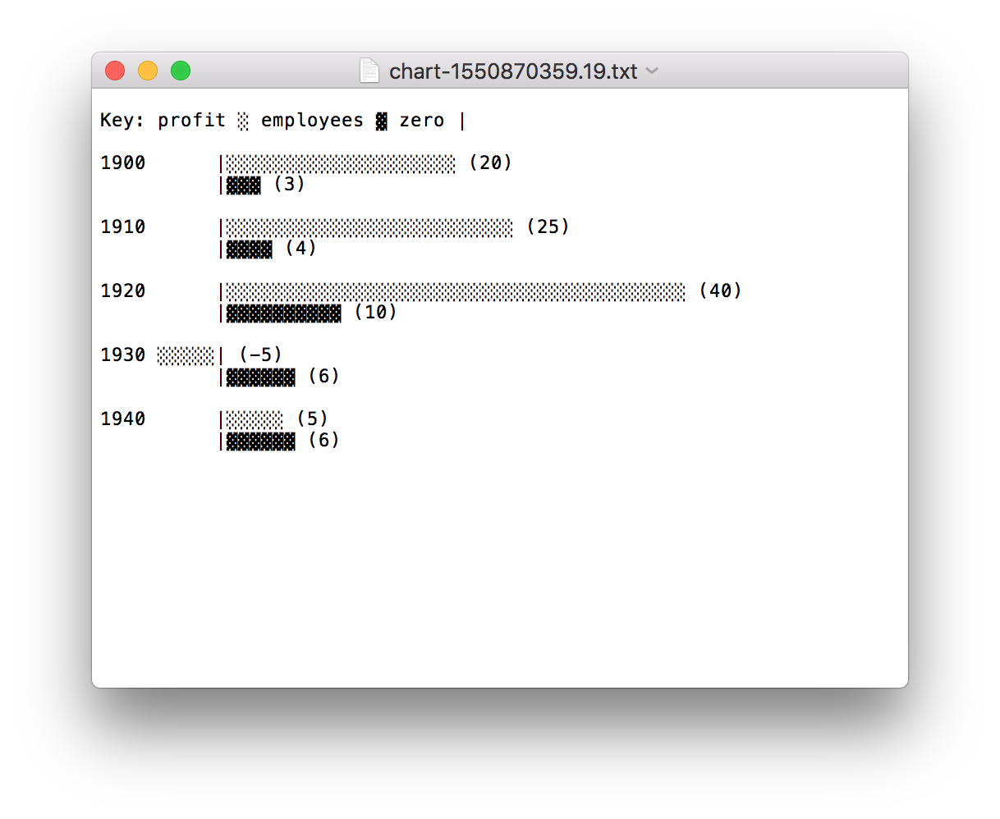

# Chart from CSV
Parse a CSV and generate a bar chart of the data.

## Usage
To convert a file name `sample1.csv` that lives in the `data` directory of this
project, enter the following command at the command prompt from the project's
root directory.

```
python run.py --file=data/sample1.csv
```

Running the command should produce a chart in the console and saves a `*.txt`
version of the chart to a file in the `output` directory.

<p>
<em>Example console output for `data/sample1.csv`</em></p>

<p>
<em>Example textfile output for `data/sample1.csv`</em></p>

## Caveats

1. Please make the first column of your spreadsheet the X-axis label value 
   (i.e., year).
2. Please make sure your CSV has a header row at row 1, if it does not, the
   data in row 1 will be skipped.
3. Currently this package only support comma-separated-values and does not
   support XLSX, XLS, or tab-separated-values.

## Examples
Example CSV files for testing have been added to the `data` directory.

## Testing
To execute testing a virtual environment with the following test packages must
be installed in the project directory.

- PyCodeStyle
- PyDocStyle
- Nose
- Bandit

### Creating a Virtual Environment
To create a virtual environment to install project specific packages to,
execute this command at the Command Line.

```
virtualenv venv
```

To start the virtual environment after installation. Execute the following
command.

```
source venv/bin/activate
```

Finally, to install the testing packages execute the following command.

```
pip install -r requirements.txt
```

## Objectives

1. Use any programming language
2. Include instructions to run
3. Output the chart however you choose, but do not use a charting library
4. Run the sample with the data included, as well as several other test cases
5. Important
    - Code Structure
    - Code Style
    - Code Comments
    - Code Corectness

## Chart Requirements
- Must represent both employees and profits
- Must support negative, zero, and null values
